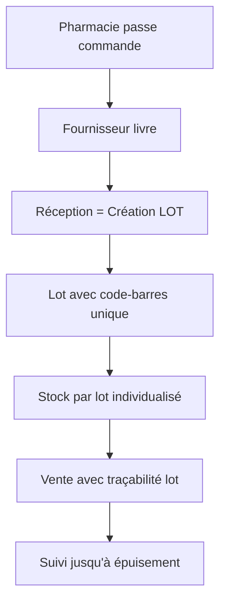
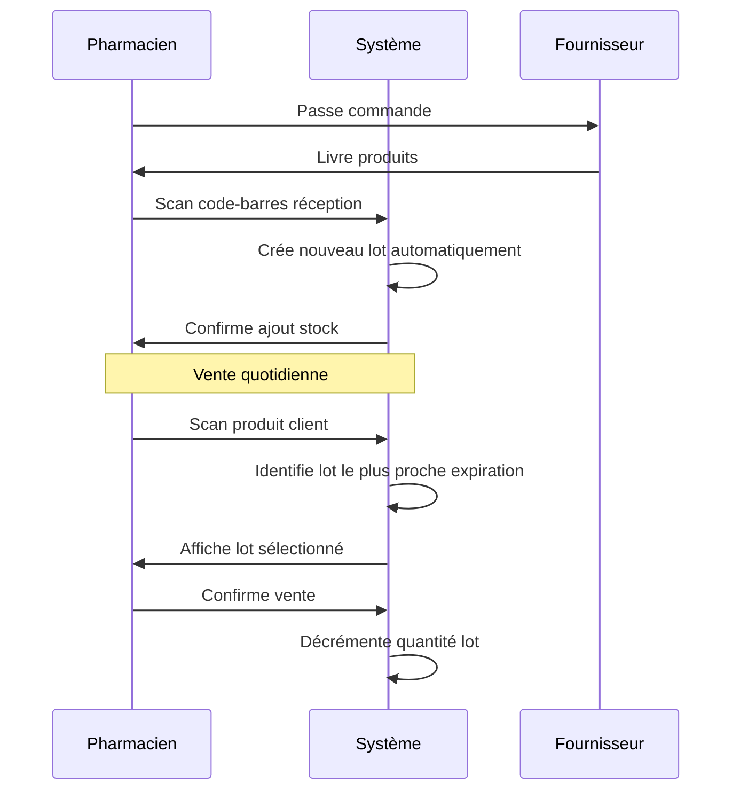
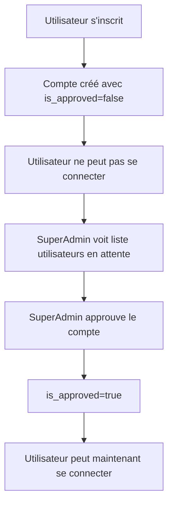
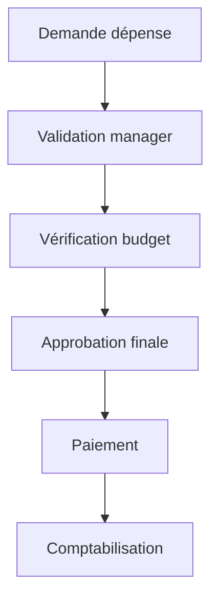
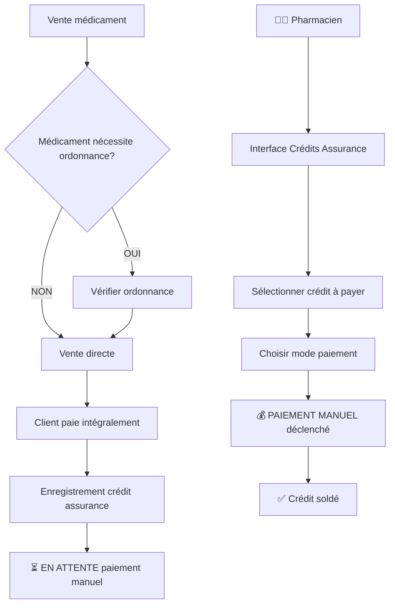

# 🏥 Pharmacie Mauritanienne - Amazon (MVP Avancé)

Application web moderne de gestion de pharmacie adaptée au contexte mauritanien.
Gère stocks (lots & DLC), ventes, retours/remboursements, contraintes d'ordonnance, fournisseurs, facturation (paiements/crédits/assurances), trésorerie, utilisateurs multi-rôles.

## 🌍 **Spécificités Mauritaniennes**

- **Système bilingue** : Français ⇄ Arabe (RTL) avec changement à la volée
- **Dark Mode intelligent** : Mode sombre adaptatif
- **Gestion ordonnances** conforme à la réglementation sanitaire mauritanienne
- **Système de paiements intégré** : Salaires, fournisseurs, dépenses, ventes
- **Gestion financière complète** : Crédits, assurances, comptabilité

## 📋 Statut du Projet

### ✅ Étape 1 : Authentification (TERMINÉE)

L'authentification avec gestion des rôles est **complètement implémentée** et **fonctionnelle**.

### ✅ Étape 2 : Stock & Produits avec Gestion des Lots (TERMINÉE)

Le système de gestion des stocks avec **traçabilité par lots pharmaceutiques** est **complètement implémenté** et **fonctionnel**.

## 💊 **Concept Fondamental : Gestion des Lots Pharmaceutiques**

### 🔄 **Workflow Commande → Lot → Stock**



### 📋 **Anatomie d'un Lot Pharmaceutique**

```json
{
    "lot": {
        "id": "LOT-2025-001",
        "code_barre": "3760123456789",
        "nom_produit": "Paracétamol 500mg",
        "categorie": "Antalgiques",
        "fournisseur": "Pharmacorp SARL",
        "date_expiration": "2026-12-31",
        "quantite_initiale": 500,
        "quantite_actuelle": 348,
        "prix_achat_unitaire": 45.0,
        "prix_vente_unitaire": 75.0,
        "date_reception": "2025-01-15",
        "numero_facture_fournisseur": "FC-2025-001",
        "statut": "actif"
    }
}
```

### 🏭 **Processus Détaillé**

#### **1. Commande Fournisseur**

```php
// Une commande peut contenir plusieurs produits
$commande = [
    'fournisseur_id' => 1,
    'numero_commande' => 'CMD-2025-001',
    'produits' => [
        ['nom' => 'Paracétamol 500mg', 'quantite' => 500],
        ['nom' => 'Aspirine 100mg', 'quantite' => 300]
    ]
];
```

#### **2. Livraison = Création de Lots**

```php
// Chaque produit livré = Un nouveau lot
foreach ($livraison['produits'] as $produit) {
    $lot = Batch::create([
        'code_barre' => generateUniqueBarcode(),
        'produit_nom' => $produit['nom'],
        'fournisseur_id' => $livraison['fournisseur_id'],
        'date_expiration' => $produit['dlc'],
        'quantite_initiale' => $produit['quantite'],
        'quantite_actuelle' => $produit['quantite']
    ]);
}
```

#### **3. Vente avec Traçabilité**

```php
// Lors d'une vente, on identifie le lot exact
$vente = [
    'produit' => 'Paracétamol 500mg',
    'quantite' => 2,
    'lot_utilise' => 'LOT-2025-001', // Traçabilité obligatoire
    'code_barre_scanne' => '3760123456789'
];
```

### 🎯 **Avantages de la Gestion par Lots**

#### **📊 Traçabilité Complète**

- **Origine** : Quel fournisseur a livré ce médicament ?
- **Fraîcheur** : Quelle est la date d'expiration exacte ?
- **Historique** : Combien reste-t-il de ce lot spécifique ?
- **Conformité** : Respect des normes pharmaceutiques mauritaniennes

#### **⚠️ Gestion des Alertes**

```sql
-- Alertes automatiques par lot
SELECT * FROM lots WHERE date_expiration < DATE_ADD(NOW(), INTERVAL 30 DAY);
SELECT * FROM lots WHERE quantite_actuelle < quantite_minimale;
SELECT * FROM lots WHERE date_expiration < NOW() AND quantite_actuelle > 0;
```

#### **🔍 Recherche Avancée**

- **Par code-barres** : Scanner un produit → Trouve le lot exact
- **Par fournisseur** : Tous les lots d'un fournisseur spécifique
- **Par date d'expiration** : Lots expirant dans X jours
- **Par produit** : Tous les lots disponibles d'un médicament

### 🏗️ **Architecture Base de Données**

```sql
-- Table des lots (cœur du système)
CREATE TABLE batches (
    id BIGINT PRIMARY KEY,
    code_barre VARCHAR(50) UNIQUE,
    produit_nom VARCHAR(255),
    produit_generique VARCHAR(255),
    categorie_id BIGINT,
    fournisseur_id BIGINT,

    -- Informations lot
    numero_lot_fournisseur VARCHAR(100),
    date_expiration DATE,
    date_fabrication DATE,

    -- Quantités
    quantite_initiale INT,
    quantite_actuelle INT,
    unite_mesure ENUM('comprimés', 'ml', 'grammes'),

    -- Prix
    prix_achat_unitaire DECIMAL(10,2),
    prix_vente_unitaire DECIMAL(10,2),
    tva_taux DECIMAL(5,2),

    -- Traçabilité
    commande_id BIGINT,
    facture_fournisseur VARCHAR(100),
    date_reception DATETIME,
    receptionne_par_user_id BIGINT,

    -- Statut
    statut ENUM('actif', 'périmé', 'rappelé', 'épuisé'),

    created_at TIMESTAMP,
    updated_at TIMESTAMP
);

-- Index pour performance
CREATE INDEX idx_batches_expiration ON batches(date_expiration);
CREATE INDEX idx_batches_code_barre ON batches(code_barre);
CREATE INDEX idx_batches_fournisseur ON batches(fournisseur_id);
```

### 🔄 **Flux Opérationnel Quotidien**



#### 🔐 Fonctionnalités d'Authentification

- **Inscription** (`POST /api/auth/register`)
- **Connexion** (`POST /api/auth/login`)
- **Déconnexion** (`POST /api/auth/logout`)
- **Profil utilisateur** (`GET /api/auth/user`)
- **Gestion des rôles** (`GET /api/auth/roles`, `PUT /api/auth/users/{id}/role`)

#### 📦 Fonctionnalités de Stock & Gestion des Lots

- **Gestion des catégories** (`GET|POST|PUT|DELETE /api/stock/categories`)
- **Gestion des fournisseurs** (`GET|POST|PUT|DELETE /api/stock/suppliers`)
- **Gestion des produits & lots** (`GET|POST|PUT|DELETE /api/stock/products`)
- **Gestion des lots pharmaceutiques** (`GET|POST|PUT|DELETE /api/stock/batches`)
- **Mouvements de stock** (`GET|POST /api/stock/movements`)
- **Calcul automatique** des stocks actuels par lot
- **Détection automatique** des stocks bas et produits expirants par lot
- **Traçabilité complète** : Produit → Lot → Fournisseur → Date d'expiration
- **Recherche et filtres** avancés (par code-barres, lot, DLC, fournisseur)

#### 👥 Rôles & Permissions (4 rôles)

| Rôle           | Permissions                                                    | Dashboard             |
| -------------- | -------------------------------------------------------------- | --------------------- |
| **superadmin** | Tous les droits, approbation comptes, backup/restore           | 🔧 Admin complet      |
| **admin**      | Gestion utilisateurs, produits, stocks, rapports               | 📊 Gestion avancée    |
| **pharmacien** | Validation ordonnances, médicaments contrôlés, supervision     | 💊 Pharmaceutique     |
| **vendeur**    | Ventes, libération médicaments, préparation commandes, retours | 🛒 Point de vente     |
| **caissier**   | Encaissements, remboursements, validation paiements            | 💰 Caisse & Paiements |

**Workflow d'activation** : Inscription libre → Approbation superadmin → Accès effectif

#### 🔧 **Création du SuperAdmin (SÉCURITÉ)**

⚠️ **IMPORTANT** : Le SuperAdmin ne peut être créé que via **Artisan Tinker** pour des raisons de sécurité.

```bash
# Créer le premier SuperAdmin via Tinker
php artisan tinker

# Dans Tinker :
$user = \App\Models\User::create([
    'name' => 'Super Admin',
    'email' => 'admin@pharmacie.com',
    'password' => \Hash::make('SuperAdmin123!'),
    'role' => 'superadmin',
    'email_verified_at' => now(),
    'is_approved' => true
]);

echo "SuperAdmin créé : " . $user->email;
exit
```

#### 📋 **Workflow d'Approbation des Utilisateurs**



#### 🔑 Comptes de Test

```
SuperAdmin (créé via Tinker uniquement):
- Email: admin@pharmacie.com
- Password: SuperAdmin123!
- Statut: is_approved=true (automatique)

Autres utilisateurs (via inscription web):
- Peuvent s'inscrire librement sur /register
- Statut initial: is_approved=false
- Accès bloqué jusqu'à approbation SuperAdmin

Comptes de test pré-approuvés (seeding):
Admin:
- Email: admin@pharmacie.com
- Password: password

Pharmacien:
- Email: pharmacien@pharmacie.com
- Password: password

Vendeur:
- Email: vendeur@pharmacie.com
- Password: password

Caissier:
- Email: caissier@pharmacie.com
- Password: password
```

#### 🛡️ **Sécurité du Processus d'Approbation**

```php
// Middleware personnalisé pour vérifier l'approbation
class EnsureUserApproved
{
    public function handle($request, Closure $next)
    {
        if (!$request->user()->is_approved) {
            Auth::logout();
            return redirect('/login')
                ->withErrors(['approval' => 'Votre compte doit être approuvé par un administrateur.']);
        }
        return $next($request);
    }
}

// Routes protégées par l'approbation
Route::middleware(['auth', 'approved'])->group(function () {
    Route::get('/dashboard', [DashboardController::class, 'index']);
    // Toutes les autres routes de l'application...
});
```

## 🚀 Démarrage Rapide

### 1. Installation

```bash
composer install
npm install
cp .env.example .env
php artisan key:generate
```

### 2. Base de données

```bash
php artisan migrate
php artisan db:seed
```

### 2.5. Création du SuperAdmin (OBLIGATOIRE)

```bash
# ÉTAPE CRITIQUE : Créer le premier SuperAdmin
php artisan tinker

# Dans Tinker, copier-coller cette commande :
$user = \App\Models\User::create(['name' => 'Super Admin', 'email' => 'admin@pharmacie.com', 'password' => \Hash::make('SuperAdmin123!'), 'role' => 'superadmin', 'email_verified_at' => now(), 'is_approved' => true]);

exit
```

⚠️ **IMPORTANT** : Sans cette étape, aucun utilisateur ne pourra être approuvé !

### 3. Lancement

```bash
# Terminal 1 - Backend
php artisan serve

# Terminal 2 - Frontend
npm run dev
```

## 📋 Plan d'Installation Complet

### Prérequis Système

- **PHP** >= 8.2
- **Node.js** >= 18.x
- **Composer** >= 2.x
- **MySQL** >= 8.0
- **Git**

### Étape 1 : Configuration de la Base de Données MySQL

#### Installation de MySQL

**Windows :**

```bash
# Télécharger et installer MySQL Community Server depuis https://dev.mysql.com/downloads/mysql/
# Ou utiliser Chocolatey
choco install mysql

# Ou utiliser XAMPP/WAMP pour une installation complète
```

**macOS :**

```bash
# Avec Homebrew
brew install mysql
brew services start mysql

# Ou télécharger depuis https://dev.mysql.com/downloads/mysql/
```

**Linux (Ubuntu/Debian) :**

```bash
sudo apt update
sudo apt install mysql-server
sudo systemctl start mysql
sudo systemctl enable mysql
```

#### Configuration MySQL

```bash
# Connexion à MySQL
mysql -u root -p

# Créer la base de données
CREATE DATABASE pharmacie_amazon CHARACTER SET utf8mb4 COLLATE utf8mb4_unicode_ci;

# Créer un utilisateur dédié (optionnel)
CREATE USER 'pharmacie_user'@'localhost' IDENTIFIED BY 'password_secure';
GRANT ALL PRIVILEGES ON pharmacie_amazon.* TO 'pharmacie_user'@'localhost';
FLUSH PRIVILEGES;
EXIT;
```

#### Configuration `.env`

```env
DB_CONNECTION=mysql
DB_HOST=127.0.0.1
DB_PORT=3306
DB_DATABASE=pharmacie_amazon
DB_USERNAME=pharmacie_user
DB_PASSWORD=password_secure
```

### Étape 2 : Installation de shadcn/ui

[shadcn/ui](https://ui.shadcn.com/docs) est déjà configuré dans le projet. Pour l'ajouter manuellement :

```bash
# Initialiser shadcn/ui (déjà fait)
npx shadcn@latest init

# Ajouter des composants spécifiques
npx shadcn@latest add button
npx shadcn@latest add input
npx shadcn@latest add card
npx shadcn@latest add table
npx shadcn@latest add dialog
npx shadcn@latest add form
npx shadcn@latest add select
npx shadcn@latest add badge
npx shadcn@latest add alert
npx shadcn@latest add toast
npx shadcn@latest add dropdown-menu
npx shadcn@latest add navigation-menu
```

### Étape 3 : Intégration de ReactBits.dev

[ReactBits.dev](https://reactbits.dev/) pour des composants React réutilisables :

```bash
# Installer les dépendances supplémentaires
npm install lucide-react class-variance-authority clsx tailwind-merge

# Copier des composants depuis ReactBits.dev
# Visiter https://reactbits.dev/ et copier les composants dans :
# resources/js/components/ui/
```

### Étape 4 : Utilisation de MVPBlocks

[MVPBlocks](https://blocks.mvp-subha.me/) pour des sections UI préconçues :

```bash
# Installer Framer Motion pour les animations
npm install framer-motion

# Les blocs sont disponibles en copy-paste depuis https://blocks.mvp-subha.me/
# Copier les sections nécessaires dans :
# resources/js/components/blocks/
```

### Étape 4.5 : Installation Complète du Projet

```bash
# Cloner le projet
git clone <repository-url>
cd pharmacie/Amazon

# Installation des dépendances PHP
composer install

# Installation des dépendances Node.js
npm install

# Configuration environnement
cp .env.example .env
php artisan key:generate

# Configuration base de données dans .env (voir Étape 1)

# Migration et seeding
php artisan migrate
php artisan db:seed

# Build des assets
npm run build

# Installation des composants UI supplémentaires (optionnel)
npx shadcn@latest add calendar
npx shadcn@latest add date-picker
npx shadcn@latest add chart
npx shadcn@latest add data-table
```

### Étape 6 : Lancement et Vérification

```bash
# Terminal 1 - Backend Laravel
php artisan serve

# Terminal 2 - Frontend Vite (développement)
npm run dev

# Vérification des URLs
# http://localhost:8000 - Application principale
# http://localhost:8000/api/stock - Interface moderne
# http://localhost:8000/pharmacy/products - Gestion produits
```

### Étape 7 : Configuration Production (Optionnel)

```bash
# Optimisation Laravel
php artisan config:cache
php artisan route:cache
php artisan view:cache

# Build production
npm run build

# Configuration serveur web (Apache/Nginx)
# Pointer vers le dossier public/
```

### Structure des Composants UI

```
resources/js/components/
├── ui/                  # shadcn/ui components
├── blocks/              # MVPBlocks sections
├── bits/                # ReactBits.dev components
└── pharmacy/            # Composants métier pharmacie
```

## 📁 Architecture

```
Amazon/
├── specs/                    # 📋 Documentation spec-kit
│   ├── features/            # User Stories & Acceptance Criteria
│   ├── apis/               # Spécifications API REST
│   └── decisions/          # Décisions techniques (ADR)
├── app/
│   ├── Services/           # 🛠️ Services métier
│   │   └── PermissionService.php
│   ├── Http/
│   │   ├── Controllers/Api/
│   │   │   └── AuthController.php
│   │   ├── Middleware/
│   │   │   ├── RoleMiddleware.php
│   │   │   └── PermissionMiddleware.php
│   │   └── Requests/Auth/
│   │       ├── LoginRequest.php
│   │       └── RegisterRequest.php
│   └── Models/
│       └── User.php        # 🔐 Modèle utilisateur + Sanctum
├── database/
│   ├── migrations/         # 🗄️ Migrations DB
│   └── seeders/           # 🌱 Données initiales
└── routes/
    └── api.php            # 🛣️ Routes API REST
```

## 🧪 Tests

### Tests API

- ✅ Inscription utilisateur
- ✅ Connexion/Déconnexion
- ✅ Gestion des rôles
- ✅ Middleware de sécurité
- ✅ Rate limiting

### Tests Unitaires

```bash
php artisan test
```

## 📚 Documentation

Toute la documentation est dans `/specs/` selon le standard **spec-kit** :

- **Features** : User stories et critères d'acceptation
- **APIs** : Spécifications REST complètes
- **Decisions** : Choix techniques documentés (ADR)

## 🎯 **Roadmap MVP - 10 Semaines (5 Sprints)**

### **Sprint 0 : Setup & Architecture** (1 semaine) ⚙️

- [x] Repo, CI, starter Laravel + React
- [ ] DB schema complet avec nouvelles tables
- [ ] Configuration environnement production

### **Sprint 1 : Core & Authentification** (2 semaines) 🔐

- [x] Auth 4 rôles + workflow d'approbation
- [x] UI layouts responsive (mobile-first)
- [x] Gestion produits + contraintes ordonnance
- [x] CRUD lots avec traçabilité

### **Sprint 2 : Architecture SPA & POS** (2 semaines) 🛒

- [ ] **🚨 CORRECTION Architecture SPA** : Supprimer routes web.php, tout en API REST
- [ ] **React Router DOM** : Routage client-side complet
- [ ] **API Client Axios** : Communication REST uniquement
- [ ] **Point de Vente** avec interface moderne
- [ ] Modes paiement multiples (espèces, mobile money, carte)
- [ ] Facturation PDF + TVA mauritanienne

### **Sprint 3 : Retours & Ordonnances** (2 semaines) 💊

- [ ] **Module retours/remboursements** complet
- [ ] **Gestion ordonnances** (libre, prescription, contrôlé)
- [ ] Workflow validation pharmacien
- [ ] **Backup/restore automatique**

### **Sprint 4 : Avancé & Fournisseurs** (2 semaines) 📦

- [ ] Fournisseurs & commandes complètes
- [ ] Correction stock et ajustements
- [ ] **Migration données** existantes
- [ ] **Rapports avancés**

### **Sprint 5 : Internationalisation & UI** (2 semaines) 🌍

- [ ] **Système bilingue Français/Arabe** avec RTL
- [ ] **Dark Mode intelligent** (manuel + automatique)
- [ ] **Interface responsive** optimisée mobile/tablette
- [ ] **Accessibilité** complète (WCAG 2.1)

### **Sprint 6 : Gestion Financière Avancée** (2 semaines) 💰

- [ ] **Module Salaires** : paie employés, charges, historique
- [ ] **Gestion Dépenses** : catégorisation, validation, reporting
- [ ] **États financiers** : bilan, trésorerie, rentabilité
- [ ] **Comptabilité générale** : journal, grand livre, balance

### **Sprint 7 : Modules Crédits Séparés** (2 semaines) 🏥

- [ ] **Crédit Personnel** : comptes clients, plafonds, relances
- [ ] **Crédit Assurance** : CNAM, mutuelles privées, remboursements
- [ ] **Workflow approbation** : validation crédits, limites
- [ ] **Reporting crédits** : créances, recouvrements, impayés

### **Sprint 8 : Hub Paiements Mauritaniens** (2 semaines) 💳

- [ ] **7 Services intégrés** : Cash, Bankily, Masrivi, Sedad, Click, Moov Money, Bimbank
- [ ] **Paiements fractionnés** : combinaison multiple modes (ex: 50% Cash + 50% Bankily)
- [ ] **Paiements Sortants** : salaires, fournisseurs, dépenses
- [ ] **Validation automatique** : somme fractionnée = montant total
- [ ] **APIs Mauritaniennes** : intégration services locaux

### **Sprint 9 : Finalisation & Déploiement** (1 semaine) 🚀

- [ ] Tests intensifs offline/online avec paiements fractionnés
- [ ] **Package déploiement local** (auto-installeur)
- [ ] Hardening sécurité & audit trail
- [ ] Documentation utilisateur complète bilingue
- [ ] Formation utilisateurs sur paiements mauritaniens

## 📋 **Modules Détaillés (MVP)**

### 🔄 **Architecture SPA** (PRIORITÉ HAUTE)

**Architecture Single Page Application :**

```typescript
// Structure SPA React
App.tsx
├── Router (React Router DOM)
├── AuthProvider (Context API)
├── API Client (Axios)
└── Pages
    ├── Dashboard
    ├── Stock
    ├── Sales
    ├── Reports
    └── Settings

// Routage client-side (pas de rechargement page)
const routes = {
    '/': 'Dashboard',
    '/stock': 'Stock Management',
    '/stock/categories': 'Categories',
    '/stock/products': 'Products',
    '/sales': 'Point of Sale',
    '/reports': 'Reports',
    '/settings': 'Settings'
};
```

**Communication API REST uniquement :**

```typescript
// ✅ CORRECT - API REST (SPA)
const ApiClient = {
    // Authentification
    login: () => POST('/api/auth/login'),
    logout: () => POST('/api/auth/logout'),

    // Stock
    getProducts: () => GET('/api/stock/products'),
    getCategories: () => GET('/api/stock/categories'),

    // Ventes
    createSale: (data) => POST('/api/sales', data),

    // Toutes les réponses sont JSON, pas de HTML
};

// ❌ INCORRECT - Pages web traditionnelles
// Route::get('/pharmacy/products', 'showBladeView') // Non!
```

### 💊 **Gestion Ordonnances** (NOUVEAU)

**Types de médicaments :**

- **Libre** : Vente sans contrainte
- **Sur ordonnance** : Prescription valide requise
- **Contrôlé** : Validation pharmacien obligatoire

**Workflow ordonnance :**

- Scan/photo ordonnance (stockage local)
- Vérification validité (date, médecin, patient)
- Contrôle posologie et interactions
- Traçabilité patient (historique anonymisé)

### ↩️ **Retours/Remboursements** (NOUVEAU)

**Types de retours :**

- Produit périmé/défectueux
- Erreur de vente
- Changement médication
- Retour partiel (entamé)

**Workflow :**

- Sélection produit (scan code-barres)
- Vérification éligibilité (délai, état)
- Choix motif + validation niveau requis
- Génération avoir ou remboursement
- Impact automatique stock + comptabilité

### 💾 **Backup & Restauration** (NOUVEAU)

**Backup automatique :**

- Export MySQL quotidien (3h du matin)
- Rétention 30 jours local + cloud optionnel
- Backup incrémental images/documents
- Notifications succès/échec

**Restauration :**

- Interface graphique simple
- Validation avant écrasement
- Restauration sélective par module
- Log des opérations

### 🌍 **Système Bilingue Français/Arabe** (NOUVEAU)

**Fonctionnalités linguistiques :**

- **Changement à la volée** : Bouton langue dans header
- **RTL (Right-to-Left)** : Interface complète en arabe
- **Traductions contextuelles** : Termes pharmaceutiques précis
- **Dates localisées** : Format mauritanien/arabe
- **Nombres et devises** : Format MRU localisé

**Architecture technique :**

```typescript
interface LanguageConfig {
    locale: 'fr' | 'ar';
    direction: 'ltr' | 'rtl';
    dateFormat: string;
    currencyFormat: string;
    translations: {
        [key: string]: string;
    };
}

// Exemple traductions
const translations = {
    fr: {
        dashboard: 'Tableau de bord',
        medications: 'Médicaments',
        sales: 'Ventes',
        suppliers: 'Fournisseurs',
    },
    ar: {
        dashboard: 'لوحة المعلومات',
        medications: 'الأدوية',
        sales: 'المبيعات',
        suppliers: 'الموردون',
    },
};
```

### 🌙 **Dark Mode Intelligent** (NOUVEAU)

**Modes d'affichage :**

- **Mode Clair** : Interface standard jour
- **Mode Sombre** : Interface adaptée faible luminosité
- **Mode Auto** : Basculement automatique selon l'heure (18h-6h)
- **Mode Système** : Suit les préférences OS

**Avantages pharmacie :**

- **Réduction fatigue oculaire** : Travail nocturne/urgences
- **Économie batterie** : Tablettes/mobiles
- **Meilleur contraste** : Lecture écrans dans pharmacie sombre
- **Personnalisation** : Préférence individuelle par utilisateur

```css
/* Variables CSS dynamiques */
:root {
    --bg-primary: #ffffff;
    --bg-secondary: #f8f9fa;
    --text-primary: #212529;
    --text-secondary: #6c757d;
    --border-color: #dee2e6;
}

[data-theme='dark'] {
    --bg-primary: #1a1a1a;
    --bg-secondary: #2d2d2d;
    --text-primary: #ffffff;
    --text-secondary: #b3b3b3;
    --border-color: #444444;
}
```

### 💰 **Module Salaires & Gestion RH** (NOUVEAU)

**Fonctionnalités RH :**

- **Fiches employés** : Informations complètes, contrats
- **Calcul paie** : Salaire base + primes + charges
- **Historique paies** : Archives avec bulletins PDF
- **Congés/absences** : Suivi et validation
- **Évaluations** : Performance et formation

**Calculs automatiques :**

```php
class SalaryCalculator {
    public function calculateSalary($employee, $month) {
        $baseSalary = $employee->base_salary;
        $overtime = $this->calculateOvertime($employee, $month);
        $bonuses = $this->calculateBonuses($employee, $month);
        $deductions = $this->calculateDeductions($employee, $month);

        return [
            'gross' => $baseSalary + $overtime + $bonuses,
            'deductions' => $deductions,
            'net' => ($baseSalary + $overtime + $bonuses) - $deductions,
            'employer_charges' => $this->calculateEmployerCharges($baseSalary)
        ];
    }
}
```

### 📊 **Gestion Dépenses & Comptabilité** (NOUVEAU)

**Types de dépenses :**

- **Dépenses courantes** : Électricité, loyer, téléphone
- **Investissements** : Équipements, mobilier, travaux
- **Fournitures** : Matériel médical, administrative
- **Services** : Maintenance, assurance, expert-comptable

**Workflow validation :**



### 👤 **Module Crédit Personnel** (NOUVEAU)

**Gestion comptes clients :**

- **Ouverture compte crédit** : Dossier client complet, pièces justificatives
- **Plafonds dynamiques** : Calcul basé sur historique, revenus
- **Achats à crédit** : Déduction automatique du plafond disponible
- **Paiements fractionnés** : Support 7 modes de paiement mauritaniens
- **Relances automatiques** : SMS/Email selon échéances
- **Historique détaillé** : Traçabilité complète des créances

**Workflow crédit personnel :**

```typescript
interface PersonalCredit {
    customer_id: string;
    credit_limit: number;
    used_amount: number;
    available_amount: number;
    payment_methods: PaymentMethod[];
    status: 'active' | 'suspended' | 'closed';
    payment_terms: {
        max_days: number;
        penalty_rate: number;
        grace_period: number;
    };
}

// Exemple paiement crédit fractionné
const creditPayment = {
    customer_id: 'CUST-001',
    total_amount: 15000, // MRU
    split_payments: [
        { method: 'cash', amount: 5000 }, // 33%
        { method: 'bankily', amount: 6000 }, // 40%
        { method: 'masrivi', amount: 4000 }, // 27%
    ],
};
```

### 🏥 **Module Crédit Assurance** (NOUVEAU)

**Gestion Dynamique des Assurances :**

- **Ajout/Suppression libre** : Vous pouvez créer et supprimer toute assurance
- **Configuration flexible** : Taux, plafonds, conditions personnalisables
- **Paiement MANUEL uniquement** : Aucun paiement automatique
- **Ordonnances conditionnelles** : Selon le type de médicament

**Interface Gestion Assurances :**

```typescript
interface InsuranceCompany {
    id: string;
    nom: string;
    type: 'publique' | 'privee' | 'entreprise' | 'internationale';
    taux_remboursement: number; // 0.1 à 1.0
    plafond_annuel: number; // en MRU
    statut: 'active' | 'suspendue' | 'archivee';

    // Conditions médicaments
    medicaments_couverts: 'tous' | 'liste_positive' | 'liste_negative';
    liste_medicaments?: string[]; // IDs produits couverts/exclus

    // Workflow
    paiement_mode: 'manuel_uniquement'; // Toujours manuel
    ordonnance_requise: 'jamais' | 'selon_medicament' | 'toujours';
    pre_autorisation_requise: boolean;

    // Informations contact
    contact_personne?: string;
    telephone?: string;
    email?: string;
    adresse?: string;

    created_by: string; // ID utilisateur créateur
    created_at: Date;
}

// Exemple configuration assurance personnalisée
const assurance_exemple = {
    id: 'ASS-001',
    nom: 'Mutuelle Pharmaciens Mauritanie', // Nom libre
    type: 'privee',
    taux_remboursement: 0.75, // 75% remboursement
    plafond_annuel: 80000, // 80,000 MRU/an
    statut: 'active',

    medicaments_couverts: 'selon_medicament', // Flexible

    paiement_mode: 'manuel_uniquement', // ✅ MANUEL SEULEMENT
    ordonnance_requise: 'selon_medicament', // ✅ Selon type médicament
    pre_autorisation_requise: false,
};
```

**Workflow Remboursement MANUEL :**



**📋 CRUD Assurances (Interface Pharmacien) :**

```typescript
class InsuranceManagement {
    // ➕ CRÉER nouvelle assurance
    async createInsurance(data: InsuranceCompany) {
        return await Insurance.create({
            ...data,
            created_by: this.currentUserId,
            paiement_mode: 'manuel_uniquement', // Toujours manuel
        });
    }

    // ✏️ MODIFIER assurance existante
    async updateInsurance(id: string, updates: Partial<InsuranceCompany>) {
        return await Insurance.findByIdAndUpdate(id, updates);
    }

    // 🗑️ SUPPRIMER assurance (soft delete)
    async deleteInsurance(id: string) {
        // Vérifier qu'il n'y a pas de crédits en cours
        const pendingCredits = await InsuranceCredit.where('insurance_id', id)
            .where('status', 'pending')
            .count();

        if (pendingCredits > 0) {
            throw new Error(
                `Impossible de supprimer: ${pendingCredits} crédits en cours`,
            );
        }

        return await Insurance.findByIdAndUpdate(id, {
            statut: 'archivee',
            deleted_at: new Date(),
        });
    }

    // 📊 LISTER assurances avec statistiques
    async listInsurances() {
        return await Insurance.aggregate([
            { $match: { statut: { $ne: 'archivee' } } },
            {
                $lookup: {
                    from: 'insurance_credits',
                    localField: '_id',
                    foreignField: 'insurance_id',
                    as: 'credits',
                },
            },
            {
                $addFields: {
                    total_credits_pending: {
                        $size: {
                            $filter: {
                                input: '$credits',
                                cond: { $eq: ['$$this.status', 'pending'] },
                            },
                        },
                    },
                    montant_total_pending: {
                        $sum: {
                            $map: {
                                input: {
                                    $filter: {
                                        input: '$credits',
                                        cond: {
                                            $eq: ['$$this.status', 'pending'],
                                        },
                                    },
                                },
                                in: '$$this.amount',
                            },
                        },
                    },
                },
            },
        ]);
    }
}
```

**🧾 Gestion Ordonnances par Médicament :**

```typescript
// Configuration au niveau produit
interface Product {
    id: string;
    nom: string;
    categorie: string;

    // ✅ Gestion ordonnance flexible
    prescription_requise: boolean; // TRUE/FALSE par médicament
    type_prescription: 'simple' | 'renouvelable' | 'non_renouvelable';
    duree_validite_ordonnance?: number; // en jours

    // Exemples:
    // Paracétamol: prescription_requise = false
    // Antibiotiques: prescription_requise = true
    // Psychotropes: prescription_requise = true + non_renouvelable
}

// Validation lors de la vente
class SaleValidation {
    validatePrescription(product: Product, ordonnance?: Ordonnance): boolean {
        if (!product.prescription_requise) {
            return true; // ✅ Médicament libre, pas d'ordonnance nécessaire
        }

        if (!ordonnance) {
            throw new Error(`Ordonnance requise pour ${product.nom}`);
        }

        // Validation ordonnance...
        return this.isValidPrescription(ordonnance, product);
    }
}
```

## 🤔 **EXPLICATION - Mutuelles Privées (MGMO, etc.)**

**MGMO** = **Mutuelle Générale des Militaires et Ouvriers** (exemple mauritanien)

### **Qu'est-ce qu'une Mutuelle Privée ?**

Une mutuelle privée est une **assurance santé complémentaire** qui :

1. **Complète** les remboursements de base (ex: CNAM publique)
2. **Rembourse plus** (90% vs 80% du public)
3. **Couvre plus de médicaments** (y compris les plus chers)
4. **Traite plus rapidement** (15 jours vs 30 jours)

### **Exemple Concret :**

```typescript
// Médicament coûteux: 10,000 MRU
const medicament_cher = {
    prix: 10000, // MRU

    // Avec CNAM publique (80%)
    cnam: {
        remboursement: 8000, // 80% de 10,000
        reste_patient: 2000, // Patient paie 2,000
        delai: '30 jours',
    },

    // Avec Mutuelle Privée MGMO (90%)
    mgmo: {
        remboursement: 9000, // 90% de 10,000
        reste_patient: 1000, // Patient paie seulement 1,000
        delai: '15 jours', // Plus rapide

        // ✅ Pré-autorisation = Accord AVANT achat
        pre_autorisation: {
            required: true, // Pour médicaments >5,000 MRU
            comment: 'Pharmacie doit demander accord MGMO avant vente',
            delai_reponse: '24-48h',
            moyens: ['telephone', 'email', 'plateforme_web'],
        },
    },
};
```

### **Pré-autorisation Expliquée :**

**Avant** la vente de médicaments coûteux :

1. **Pharmacie contacte MGMO** : "Client X veut médicament Y à 10,000 MRU"
2. **MGMO vérifie** : plafond client, historique, nécessité médicale
3. **MGMO répond** : "✅ Accordé" ou "❌ Refusé"
4. **Si accordé** : Vente possible, remboursement garanti
5. **Si refusé** : Client paie intégralement ou choisit alternative

### **Avantages Mutuelles Privées :**

- 💰 **Remboursement supérieur** (90% vs 80%)
- ⚡ **Traitement rapide** (15 jours vs 30 jours)
- 🏥 **Couverture étendue** (médicaments non-remboursés par public)
- 🎯 **Service personnalisé** (gestionnaire dédié)

**Dans votre système : Tout sera MANUEL, vous décidez quand payer !** ✅

## 🚨 **CORRECTION URGENTE - Architecture SPA**

### **❌ Problème Actuel**

L'application utilise actuellement un **mélange incorrect** :

- Routes `web.php` avec vues Blade → **Rechargement de page**
- Routes `api.php` avec JSON → **Bon pour SPA**

```php
// ❌ PROBLÈME dans routes/web.php
Route::get('/pharmacy/products', [StockController::class, 'productsPage']);
// Ceci génère une page HTML complète = rechargement page

// ✅ CORRECT dans routes/api.php
Route::get('/api/stock/products', [ProductController::class, 'index']);
// Ceci retourne JSON pour React
```

### **✅ Solution : Architecture SPA Pure**

#### **1. Supprimer routes web.php pharmaceutiques**

```php
// À SUPPRIMER de routes/web.php :
Route::prefix('pharmacy')->group(function () {
    Route::get('/categories', [StockController::class, 'categoriesPage']); // ❌
    Route::get('/suppliers', [StockController::class, 'suppliersPage']);   // ❌
    Route::get('/movements', [StockController::class, 'movementsPage']);   // ❌
    Route::get('/products', [StockController::class, 'productsPage']);     // ❌
});
```

#### **2. Étendre routes/api.php**

```php
// À AJOUTER dans routes/api.php :
Route::middleware('auth:sanctum')->group(function () {

    // 🏥 Pharmacy Management API
    Route::prefix('pharmacy')->group(function () {

        // Dashboard principal
        Route::get('/dashboard', [PharmacyController::class, 'dashboard']);

        // Modules métier
        Route::get('/categories', [CategoryController::class, 'index']);
        Route::get('/suppliers', [SupplierController::class, 'index']);
        Route::get('/products', [ProductController::class, 'index']);
        Route::get('/movements', [StockMovementController::class, 'index']);

        // Ventes
        Route::prefix('sales')->group(function () {
            Route::get('/', [SalesController::class, 'index']);
            Route::post('/', [SalesController::class, 'store']);
            Route::get('/{sale}', [SalesController::class, 'show']);
        });

        // Paiements fractionnés
        Route::prefix('payments')->group(function () {
            Route::get('/methods', [PaymentController::class, 'getMethods']);
            Route::post('/split', [PaymentController::class, 'processSplitPayment']);
        });

        // Crédits
        Route::prefix('credits')->group(function () {
            Route::get('/personal', [PersonalCreditController::class, 'index']);
            Route::get('/insurance', [InsuranceCreditController::class, 'index']);
            Route::post('/insurance/pay', [InsuranceCreditController::class, 'manualPayment']);
        });
    });
});
```

#### **3. Structure React Router**

```typescript
// App.tsx - Routage SPA complet
import { BrowserRouter, Routes, Route } from 'react-router-dom';

function App() {
    return (
        <BrowserRouter>
            <Routes>
                {/* Dashboard principal */}
                <Route path="/" element={<Dashboard />} />

                {/* Gestion Stock */}
                <Route path="/stock" element={<StockLayout />}>
                    <Route index element={<StockDashboard />} />
                    <Route path="categories" element={<Categories />} />
                    <Route path="products" element={<Products />} />
                    <Route path="suppliers" element={<Suppliers />} />
                    <Route path="movements" element={<Movements />} />
                </Route>

                {/* Point de Vente */}
                <Route path="/sales" element={<SalesLayout />}>
                    <Route index element={<POS />} />
                    <Route path="history" element={<SalesHistory />} />
                </Route>

                {/* Gestion Crédits */}
                <Route path="/credits" element={<CreditsLayout />}>
                    <Route path="personal" element={<PersonalCredits />} />
                    <Route path="insurance" element={<InsuranceCredits />} />
                </Route>

                {/* Paiements */}
                <Route path="/payments" element={<PaymentsHub />} />

                {/* Paramètres */}
                <Route path="/settings" element={<Settings />} />
            </Routes>
        </BrowserRouter>
    );
}
```

#### **4. Communication API uniquement**

```typescript
// api/client.ts - Client API centralisé
import axios from 'axios';

const apiClient = axios.create({
    baseURL: '/api',
    headers: {
        Accept: 'application/json',
        'Content-Type': 'application/json',
    },
});

// Intercepteur pour token Sanctum
apiClient.interceptors.request.use((config) => {
    const token = localStorage.getItem('auth_token');
    if (token) {
        config.headers.Authorization = `Bearer ${token}`;
    }
    return config;
});

export const PharmacyAPI = {
    // Stock
    getCategories: () => apiClient.get('/pharmacy/categories'),
    getProducts: () => apiClient.get('/pharmacy/products'),

    // Ventes
    createSale: (data) => apiClient.post('/pharmacy/sales', data),

    // Paiements fractionnés
    processSplitPayment: (data) =>
        apiClient.post('/pharmacy/payments/split', data),

    // Crédits assurance (paiement manuel)
    payInsuranceCredit: (creditId, paymentData) =>
        apiClient.post(
            `/pharmacy/credits/insurance/${creditId}/pay`,
            paymentData,
        ),
};
```

### **✅ Avantages SPA Pure**

1. **🚀 Navigation instantanée** : Pas de rechargement page
2. **📱 Expérience mobile** : Fluide comme une app native
3. **⚡ Performance** : Cache côté client
4. **🔄 Offline** : Possible avec Service Worker
5. **🎯 État global** : Persistance données entre pages
6. **💫 Animations** : Transitions fluides entre vues

### **📋 Actions Immédiates**

1. **Supprimer** routes web.php pharmaceutiques
2. **Supprimer** vues Blade pharmacie
3. **Étendre** routes/api.php
4. **Créer** composants React pour chaque page
5. **Configurer** React Router DOM
6. **Tester** navigation sans rechargement

### 💳 **Hub Paiements Intégré** (NOUVEAU)

**Architecture unifiée :**

```typescript
interface PaymentMethod {
    id: string;
    name: string;
    type:
        | 'cash'
        | 'bankily'
        | 'masrivi'
        | 'sedad'
        | 'click'
        | 'moov_money'
        | 'bimbank'
        | 'personal_credit'
        | 'insurance_credit';
    fees: number;
    available: boolean;
    max_amount?: number;
    requires_verification: boolean;
    configuration: {
        api_key?: string;
        merchant_id?: string;
        webhook_url?: string;
    };
}

interface SplitPayment {
    method_id: string;
    amount: number;
    percentage: number;
    transaction_id?: string;
    status: 'pending' | 'completed' | 'failed';
}

class PaymentHub {
    // Paiements sortants
    async paySalary(
        employee_id: string,
        amount: number,
        method: PaymentMethod,
    ) {}
    async paySupplier(
        supplier_id: string,
        invoice_id: string,
        method: PaymentMethod,
    ) {}
    async payExpense(expense_id: string, method: PaymentMethod) {}

    // Paiements entrants avec support fractionné
    async receiveSale(sale_id: string, splitPayments: SplitPayment[]) {
        // Validation : somme des montants = total facture
        const total = splitPayments.reduce(
            (sum, payment) => sum + payment.amount,
            0,
        );
        if (total !== this.getSaleTotal(sale_id)) {
            throw new Error('Split payments total mismatch');
        }

        // Traitement de chaque paiement
        const results = await Promise.all(
            splitPayments.map((payment) => this.processPayment(payment)),
        );

        return {
            success: results.every((r) => r.success),
            transactions: results,
            total_amount: total,
        };
    }

    // Gestion crédits séparés
    async processPersonalCredit(customer_id: string, amount: number) {}
    async processInsuranceCredit(
        insurance_id: string,
        claim_id: string,
        amount: number,
    ) {}

    // Validation paiement fractionné
    validateSplitPayment(
        splitPayments: SplitPayment[],
        totalAmount: number,
    ): boolean {
        const calculatedTotal = splitPayments.reduce(
            (sum, payment) => sum + payment.amount,
            0,
        );
        return Math.abs(calculatedTotal - totalAmount) < 0.01; // Tolérance centimes
    }
}

// Configuration services mauritaniens
const MauritanianPaymentServices = {
    bankily: {
        name: 'Bankily',
        api_url: 'https://api.bankily.mr/v1/',
        max_amount: 500000, // MRU
        fees: 0.015, // 1.5%
        requires_phone: true,
    },
    masrivi: {
        name: 'Masrivi',
        api_url: 'https://api.masrivi.mr/v2/',
        max_amount: 200000, // MRU
        fees: 0.02, // 2%
        requires_verification: true,
    },
    sedad: {
        name: 'Sedad',
        api_url: 'https://api.sedad.mr/pay/',
        max_amount: 300000, // MRU
        fees: 0.025, // 2.5%
        instant_transfer: true,
    },
    click: {
        name: 'Click',
        api_url: 'https://click.mr/api/v1/',
        max_amount: 1000000, // MRU
        fees: 0.01, // 1%
        supports_qr: true,
    },
    moov_money: {
        name: 'Moov Money',
        api_url: 'https://api.moov.mr/money/',
        max_amount: 400000, // MRU
        fees: 0.018, // 1.8%
        telecom_integration: true,
    },
    bimbank: {
        name: 'Bimbank',
        api_url: 'https://api.bimbank.mr/v1/',
        max_amount: 2000000, // MRU
        fees: 0.012, // 1.2%
        digital_only: true,
    },
};
```

**Modes de paiement mauritaniens :**

- **Cash** : Espèces MRU (monnaie locale)
- **Bankily** : Service mobile money leader en Mauritanie
- **Masrivi** : Plateforme de paiement mobile
- **Sedad** : Service de transfert d'argent mobile
- **Click** : Solution de paiement numérique
- **Moov Money** : Service mobile money Moov Mauritanie
- **Bimbank** : Banque digitale mauritanienne

**Modules de crédit séparés :**

- **Crédit Personnel** : Comptes clients particuliers
- **Crédit Assurance** : Remboursements mutuelles/CNAM

**Paiements fractionnés :**

- **Paiement simple** : 100% d'un seul mode
- **Paiement mixte** : Combinaison de plusieurs modes
    - Exemple : 50% Cash + 30% Bankily + 20% Masrivi
    - Validation automatique : total = montant facture

## ✅ **Critères d'Acceptation MVP Complet**

### **Fonctionnalités Core**

- ✅ **Architecture SPA** : Navigation instantanée sans rechargement page
- ✅ **React Router DOM** : Routage client-side complet
- ✅ **API REST uniquement** : Communication JSON, pas de HTML
- ✅ **Performance** : Point de Vente fluide, scan code-barres <2sec
- ✅ **Retours** : Workflow retour complet avec impact stock/compta
- ✅ **Ordonnances** : Blocage vente médicaments sans prescription
- ✅ **Backup** : Restauration complète base en <5min
- ✅ **Mobile** : Interface utilisable sur tablette 10" minimum

### **Fonctionnalités Avancées (Nouveaux Modules)**

- ✅ **Bilingue** : Changement FR/AR instantané + RTL complet
- ✅ **Dark Mode** : Basculement intelligent jour/nuit
- ✅ **Salaires** : Calcul automatique paies + charges mauritaniennes
- ✅ **Dépenses** : Workflow validation + catégorisation complète
- ✅ **Crédit Personnel** : Plafonds dynamiques + 7 modes paiement
- ✅ **Crédit Assurance** : Gestion libre assurances + paiements manuels uniquement + ordonnances selon médicament
- ✅ **Paiements Fractionnés** : Combinaison modes (ex: 40% Cash + 60% Bankily)
- ✅ **Services Mauritaniens** : 7 modes intégrés (Cash, Bankily, Masrivi, Sedad, Click, Moov Money, Bimbank)
- ✅ **Validation Automatique** : Somme fractionnée = montant exact
- ✅ **Comptabilité** : États financiers temps réel + TVA mauritanienne

## 📊 **Métriques de Succès**

**Techniques :**

- **Performance POS** : <3sec par transaction moyenne
- **Disponibilité** : >99% temps de fonctionnement
- **Response time** : <500ms requêtes API
- **Stabilité** : Pas de crash pendant les heures d'ouverture

**Métier :**

- **Réduction erreurs stock** : -80% vs système manuel
- **Vitesse transaction** : +50% vs logiciel existant
- **Conformité ordonnances** : 100% médicaments contrôlés
- **Satisfaction utilisateur** : >8/10 sur interface

**Nouveaux Modules :**

- **Adoption bilingue** : >70% utilisateurs alternent FR/AR
- **Usage Dark Mode** : >40% activation mode sombre
- **Automatisation salaires** : 100% calculs sans erreur
- **Délai paiements** : <24h pour salaires/fournisseurs
- **Taux recouvrement crédits personnels** : >85% créances récupérées
- **Gestion assurances** : 100% paiements manuels, 0% automatiques
- **Adoption paiements fractionnés** : >60% ventes utilisent mode mixte
- **Services mauritaniens actifs** : 7/7 modes disponibles simultanément
- **Précision calculs fractionnés** : 100% validation automatique réussie
- **Intégration APIs locales** : >99% disponibilité services mauritaniens

## 🛠️ **Stack Technique Complet**

### **Backend (Laravel 12)**

- **Authentication** : Sanctum + custom offline tokens
- **API** : RESTful endpoints + WebSocket pour temps réel
- **Cache** : Redis (sessions, cache requêtes fréquentes)
- **Queue** : Redis (jobs background)
- **Storage** : Local + cloud optionnel pour backup

### **Frontend (React SPA)**

- **Architecture** : Single Page Application (SPA) avec React Router
- **Framework** : React + React Router + TailwindCSS
- **UI Components** : shadcn/ui + ReactBits + MVPBlocks
- **Communication** : Axios pour API REST (pas de rechargement page)
- **Storage** : LocalStorage pour préférences utilisateur
- **État** : Context/Redux pour gestion state global
- **Routage** : Client-side routing avec React Router DOM

### **Base de Données Enrichie**

```sql
-- Tables critiques système
prescriptions: gestion ordonnances
returns: historique retours/remboursements
audit_logs: traçabilité complète
backup_logs: historique sauvegardes
user_approvals: workflow d'approbation comptes

-- Tables gestion pharmaceutique (CŒUR MÉTIER)
batches: lots pharmaceutiques avec traçabilité complète
  ├─ code_barre (unique)
  ├─ produit_nom + generique
  ├─ fournisseur_id + commande_id
  ├─ dates (fabrication, expiration, réception)
  ├─ quantités (initiale, actuelle, seuil)
  ├─ prix (achat, vente, TVA)
  └─ statut (actif, périmé, rappelé, épuisé)

batch_movements: mouvements par lot
  ├─ batch_id
  ├─ type (entrée, vente, péremption, retour)
  ├─ quantite (+ ou -)
  └─ user_id + timestamp

suppliers_orders: commandes fournisseurs
  ├─ fournisseur_id
  ├─ statut (en_cours, livrée, annulée)
  └─ génère automatiquement les batches à réception
```

### **Déploiement Local Mauritanien**

- **Installation** : Package auto-installeur (XAMPP + app)
- **Réseau local** : Accès multi-postes via WiFi/LAN
- **Sync cloud** : Optionnelle, backup données uniquement
- **Maintenance** : Scripts automatiques + support remote

## 🔒 **Sécurité Renforcée**

### **Authentification & Autorisation**

- ✅ **Sanctum + offline tokens** avec rotation 4h
- ✅ **Workflow d'approbation** comptes utilisateurs
- ✅ **4 rôles RBAC** avec permissions granulaires
- ✅ **Sessions sécurisées** + gestion déconnexion auto

### **Protection Données**

- ✅ **Chiffrement local** : données sensibles IndexedDB
- ✅ **Audit trail complet** : log toutes actions critiques
- ✅ **Rate limiting** : protection API et interface
- ✅ **Validation stricte** : données entrantes/sortantes

### **Conformité Mauritanienne**

- ✅ **Traçabilité lots** : DLC, code-barres, fournisseurs
- ✅ **Ordonnances médicales** : validation pharmacien obligatoire
- ✅ **Backup sécurisé** : chiffrement export données
- ✅ **Mode offline sécurisé** : tokens cachés localement

### **Workflow Sécurisé des Comptes**

- ✅ **SuperAdmin via Tinker uniquement** : Prévient la création non autorisée
- ✅ **Approbation obligatoire** : Tous les nouveaux comptes doivent être validés
- ✅ **Middleware d'approbation** : Vérification à chaque requête authentifiée
- ✅ **Déconnexion automatique** : Si compte non approuvé détecté
- ✅ **Messages d'erreur clairs** : Informe l'utilisateur du statut d'approbation

## 🧪 **Plan de Tests Intensifs**

### **Tests d'Intégration**

- Workflow complet vente avec différents modes paiement
- Backup/restore avec données volumineuses
- Migration données depuis autre système
- Performance sous charge (100+ utilisateurs simultanés)

### **Tests Utilisabilité**

- Interface responsive sur tablette 10"
- Workflow ordonnances médicales
- Performance POS (<3sec par transaction)
- Tests d'accessibilité WCAG 2.1

## 📞 **Support & Documentation**

### **Documentation Complète**

- **`/specs/`** : Spécifications spec-kit détaillées
- **Features** : User stories et critères d'acceptation
- **APIs** : Endpoints REST complets avec exemples
- **Decisions** : ADR (Architecture Decision Records)

### **Structure Specs Enrichie**

```
/specs/
├── auth/                 # Authentification 4 rôles
├── products/             # Gestion produits & lots
├── sales/                # Point de vente tactile
├── offline-sync/         # Architecture offline/online
├── prescriptions/        # Gestion ordonnances
├── returns/              # Retours/remboursements
├── backup-restore/       # Sauvegarde/restauration
├── emergency-mode/       # Mode d'urgence
└── deployment/           # Déploiement local mauritanien
```

### **Support Technique**

1. **Documentation** : Consulter `/specs/` complet
2. **Logs** : Laravel + Service Worker + IndexedDB
3. **Tests** : Suite de tests offline/online
4. **Monitoring** : Dashboard statut connectivité

---

## 🎯 **Statut Global MVP Complet**

### **Phase 1 - Core Fonctionnel (Sprints 0-4)**

| Module                          | Statut   | Priorité | Sprint   |
| ------------------------------- | -------- | -------- | -------- |
| ✅ **Authentification 4 rôles** | TERMINÉ  | HAUTE    | Sprint 1 |
| ✅ **Stock & Gestion Lots**     | TERMINÉ  | HAUTE    | Sprint 1 |
| 🔄 **Architecture Offline**     | EN COURS | CRITIQUE | Sprint 2 |
| ⏳ **POS Tactile**              | À FAIRE  | HAUTE    | Sprint 2 |
| ⏳ **Ordonnances**              | À FAIRE  | HAUTE    | Sprint 3 |
| ⏳ **Retours/Remboursements**   | À FAIRE  | MOYENNE  | Sprint 3 |
| ⏳ **Mode Urgence**             | À FAIRE  | CRITIQUE | Sprint 4 |
| ⏳ **Backup/Restore**           | À FAIRE  | MOYENNE  | Sprint 3 |

### **Phase 2 - Modules Avancés (Sprints 5-8)**

| Module                        | Statut  | Priorité | Sprint   |
| ----------------------------- | ------- | -------- | -------- |
| ⏳ **Système Bilingue FR/AR** | À FAIRE | HAUTE    | Sprint 5 |
| ⏳ **Dark Mode Intelligent**  | À FAIRE | MOYENNE  | Sprint 5 |
| ⏳ **Interface Responsive**   | À FAIRE | HAUTE    | Sprint 5 |
| ⏳ **Module Salaires RH**     | À FAIRE | HAUTE    | Sprint 6 |
| ⏳ **Gestion Dépenses**       | À FAIRE | HAUTE    | Sprint 6 |
| ⏳ **Crédit Personnel**       | À FAIRE | CRITIQUE | Sprint 7 |
| ⏳ **Crédit Assurance**       | À FAIRE | CRITIQUE | Sprint 7 |
| ⏳ **Hub Paiements 7 Modes**  | À FAIRE | CRITIQUE | Sprint 8 |
| ⏳ **Paiements Fractionnés**  | À FAIRE | HAUTE    | Sprint 8 |

### **Phase 3 - Finalisation (Sprint 9)**

| Module                            | Statut  | Priorité | Sprint   |
| --------------------------------- | ------- | -------- | -------- |
| ⏳ **Tests Intégration Complète** | À FAIRE | CRITIQUE | Sprint 9 |
| ⏳ **Documentation Bilingue**     | À FAIRE | MOYENNE  | Sprint 9 |
| ⏳ **Package Déploiement**        | À FAIRE | HAUTE    | Sprint 9 |
| ⏳ **Formation Utilisateurs**     | À FAIRE | MOYENNE  | Sprint 9 |

**🏁 Objectif MVP Complet** : **Pharmacie digitale avec paiements mauritaniens fractionnés + modules crédits séparés en 18 semaines**

**📊 Progression** : 2/24 modules terminés (8.3%) | **⏱️ Durée totale** : 4.5 mois | **👥 Équipe** : 2-3 développeurs

### **🇲🇷 Spécificités Mauritaniennes Intégrées**

- **7 Services Paiement** : Cash + 6 solutions digitales locales
- **2 Modules Crédits** : Personnel + Assurance (CNAM/Mutuelles)
- **Paiements Fractionnés** : Combinaisons illimitées de modes
- **Interface Bilingue** : Français ⇄ Arabe avec RTL complet
- **Conformité Locale** : TVA 14%, charges sociales mauritaniennes

---

## 📋 **PRIORISATION DÉTAILLÉE DES TÂCHES**

### 🟢 **NIVEAU 1 - FACILES & RAPIDES (1-3 jours chacune)**

#### **1.1 Corrections Immédiates**

| Tâche                            | Complexité     | Durée | Priorité  | Description                                                  |
| -------------------------------- | -------------- | ----- | --------- | ------------------------------------------------------------ |
| ✅ **Supprimer routes web.php**  | 🟢 Très Facile | 30min | 🔥 URGENT | ~~Supprimer routes pharmacy dans web.php~~ **TERMINÉ**       |
| ✅ **Supprimer vues Blade**      | 🟢 Très Facile | 1h    | 🔥 URGENT | ~~Supprimer fichiers resources/views/pharmacy/~~ **TERMINÉ** |
| ✅ **Ajouter compte pharmacien** | 🟢 Facile      | 2h    | ⚡ Haute  | ~~Ajouter rôle pharmacien au seeder~~ **TERMINÉ**            |
| ✅ **Installer React Router**    | 🟢 Facile      | 1h    | ⚡ Haute  | ~~`npm install react-router-dom` + config~~ **TERMINÉ**      |

#### **1.2 API Extensions Simples**

| Tâche                                    | Complexité | Durée | Priorité | Description                                            |
| ---------------------------------------- | ---------- | ----- | -------- | ------------------------------------------------------ |
| ✅ **API /pharmacy/dashboard**           | 🟢 Facile  | 3h    | ⚡ Haute | ~~Endpoint JSON pour dashboard principal~~ **TERMINÉ** |
| ✅ **API modes paiement**                | 🟢 Facile  | 2h    | ⚡ Haute | ~~GET /api/pharmacy/payments/methods~~ **TERMINÉ**     |
| ✅ **CRUD assurances API**               | 🟡 Moyen   | 1j    | ⚡ Haute | ~~Create/Read/Update/Delete assurances~~ **TERMINÉ**   |
| ✅ **Configuration produits ordonnance** | 🟡 Moyen   | 1j    | ⚡ Haute | ~~Champ prescription_requise par produit~~ **TERMINÉ** |

#### **1.3 UI/UX Basiques**

| Tâche                          | Complexité | Durée | Priorité   | Description                       |
| ------------------------------ | ---------- | ----- | ---------- | --------------------------------- |
| **Dark Mode CSS Variables**    | 🟢 Facile  | 4h    | 🟡 Moyenne | Variables CSS + toggle dark/light |
| **Composants shadcn/ui**       | 🟢 Facile  | 1j    | ⚡ Haute   | Installer composants de base      |
| **Interface responsive**       | 🟡 Moyen   | 2j    | ⚡ Haute   | Mobile-first + tablettes          |
| **Traductions FR/AR basiques** | 🟡 Moyen   | 1j    | ⚡ Haute   | Fichiers JSON + fonction t()      |

### 🟡 **NIVEAU 2 - MOYENS (1-2 semaines chacune)**

#### **2.1 Architecture SPA**

| Tâche                     | Complexité | Durée | Priorité  | Description                            |
| ------------------------- | ---------- | ----- | --------- | -------------------------------------- |
| **Client API centralisé** | 🟡 Moyen   | 3j    | 🔥 URGENT | Axios + intercepteurs + auth token     |
| **React Router complet**  | 🟡 Moyen   | 4j    | 🔥 URGENT | Routes SPA + layouts + navigation      |
| **État global (Context)** | 🟡 Moyen   | 3j    | ⚡ Haute  | AuthContext + StockContext + UIContext |
| **Gestion erreurs API**   | 🟡 Moyen   | 2j    | ⚡ Haute  | Error boundaries + notifications       |

#### **2.2 Modules Métier Moyens**

| Tâche                       | Complexité | Durée  | Priorité   | Description                         |
| --------------------------- | ---------- | ------ | ---------- | ----------------------------------- |
| **Système ordonnances**     | 🟡 Moyen   | 1.5sem | ⚡ Haute   | Validation par produit + workflow   |
| **Module retours simples**  | 🟡 Moyen   | 1sem   | 🟡 Moyenne | CRUD retours sans workflow complexe |
| **Gestion dépenses**        | 🟡 Moyen   | 1sem   | 🟡 Moyenne | Catégories + validation + reporting |
| **Module salaires basique** | 🟡 Moyen   | 1.5sem | 🟡 Moyenne | Calculs simples + bulletins PDF     |
| **Backup/restore manuel**   | 🟡 Moyen   | 1sem   | 🟡 Moyenne | Export/Import MySQL + interface     |

#### **2.3 UI/UX Avancées**

| Tâche                        | Complexité | Durée | Priorité   | Description                     |
| ---------------------------- | ---------- | ----- | ---------- | ------------------------------- |
| **RTL complet (Arabe)**      | 🟡 Moyen   | 1sem  | 🟡 Moyenne | Direction RTL + ajustements CSS |
| **Interface responsive**     | 🟡 Moyen   | 1sem  | ⚡ Haute   | Optimisation mobile/tablette    |
| **Notifications temps réel** | 🟡 Moyen   | 4j    | 🟡 Moyenne | Toast + WebSocket optionnel     |

### 🔴 **NIVEAU 3 - COMPLEXES (2-4 semaines chacune)**

#### **3.1 Architecture Avancée**

| Tâche                         | Complexité  | Durée  | Priorité    | Description                      |
| ----------------------------- | ----------- | ------ | ----------- | -------------------------------- |
| **Optimisation performances** | 🔴 Complexe | 2sem   | ⚡ HAUTE    | Cache intelligent + lazy loading |
| **Système de monitoring**     | 🔴 Complexe | 2.5sem | 🟡 MOYENNE  | Logging + alertes + métriques    |
| **Sécurité renforcée**        | 🔴 Complexe | 3sem   | 🔥 CRITIQUE | Audit + chiffrement + validation |

#### **3.2 Modules Métier Complexes**

| Tâche                            | Complexité  | Durée  | Priorité    | Description                             |
| -------------------------------- | ----------- | ------ | ----------- | --------------------------------------- |
| **Point de Vente complet**       | 🔴 Complexe | 3sem   | 🔥 CRITIQUE | Scanner + panier + calculs + impression |
| **Paiements fractionnés**        | 🔴 Complexe | 2.5sem | 🔥 CRITIQUE | Multi-modes + validation + APIs         |
| **Hub 7 paiements mauritaniens** | 🔴 Complexe | 3sem   | 🔥 CRITIQUE | Intégration APIs Bankily/Masrivi/etc    |
| **Crédit personnel avancé**      | 🔴 Complexe | 2sem   | ⚡ Haute    | Workflow approbation + relances         |
| **Crédit assurance manuel**      | 🔴 Complexe | 2sem   | ⚡ Haute    | Interface gestion + paiements manuels   |

#### **3.3 Intégrations Système**

| Tâche                               | Complexité       | Durée  | Priorité    | Description                       |
| ----------------------------------- | ---------------- | ------ | ----------- | --------------------------------- |
| **Intégration APIs Mauritaniennes** | 🔴 Très Complexe | 4sem   | 🔥 CRITIQUE | 6 services paiement locaux        |
| **Système bilingue complet**        | 🔴 Complexe      | 2.5sem | ⚡ Haute    | FR/AR + RTL + localisation        |
| **Reporting avancé**                | 🔴 Complexe      | 2sem   | 🟡 Moyenne  | Dashboard + graphiques + exports  |
| **Migration données**               | 🔴 Complexe      | 2sem   | 🟡 Moyenne  | Import CSV + validation + mapping |

### ⚫ **NIVEAU 4 - TRÈS COMPLEXES (1-2 mois chacune)**

#### **4.1 Systèmes Critiques**

| Tâche                        | Complexité       | Durée | Priorité   | Description                         |
| ---------------------------- | ---------------- | ----- | ---------- | ----------------------------------- |
| **Système de tests complet** | ⚫ Très Complexe | 4sem  | 🟡 Moyenne | Tests unitaires + intégration + e2e |
| **Package déploiement auto** | ⚫ Complexe      | 3sem  | ⚡ Haute   | Auto-installeur Windows/Linux/Mac   |
| **Monitoring & Analytics**   | ⚫ Complexe      | 3sem  | 🟡 Moyenne | Métriques + alertes + dashboards    |

## 📊 **PLAN D'EXÉCUTION RECOMMANDÉ**

### **🎯 Phase 1 : Foundation (3-4 semaines)**

```
Semaine 1: Corrections SPA (Niveau 1.1 + 1.2)
Semaine 2: Architecture SPA basique (Niveau 2.1 partie)
Semaine 3: UI/UX fondamentaux (Niveau 1.3 + 2.3 partie)
Semaine 4: Modules métier simples (Niveau 2.2 partie)
```

### **🏗️ Phase 2 : Core Features (6-8 semaines)**

```
Semaines 5-6: Point de Vente moderne (Niveau 3.2)
Semaines 7-8: Optimisation performances (Niveau 3.1 partie)
Semaines 9-10: Paiements fractionnés (Niveau 3.2)
Semaines 11-12: Modules crédits (Niveau 3.2)
```

### **🚀 Phase 3 : Advanced & Polish (4-6 semaines)**

```
Semaines 13-14: Sécurité renforcée (Niveau 3.1)
Semaines 15-16: Intégrations mauritaniennes (Niveau 3.3)
Semaines 17-18: Tests + Déploiement (Niveau 4.1 partie)
```

## ✅ **RECOMMANDATIONS D'EXÉCUTION**

### **🔥 COMMENCER IMMÉDIATEMENT (Cette semaine)**

1. **Supprimer routes web.php** (30min)
2. **Installer React Router** (1h)
3. **Client API Axios** (1 jour)
4. **Routes SPA basiques** (2 jours)

### **⚡ PROCHAINES PRIORITÉS (Semaine suivante)**

1. **Point de Vente MVP** (interface simple)
2. **Paiements fractionnés basiques** (2-3 modes)
3. **Optimisation performances** (cache basique)
4. **Interface responsive** (mobile/tablette)

### **📋 CRITÈRES DE VALIDATION**

- ✅ **Navigation SPA** : Aucun rechargement de page
- ✅ **Responsive** : Fonctionne sur tablette 10"
- ✅ **Performance** : <3sec par action
- ✅ **Stabilité** : Pas de crash pendant heures ouverture
- ✅ **Paiements** : 3+ modes mauritaniens fonctionnels
